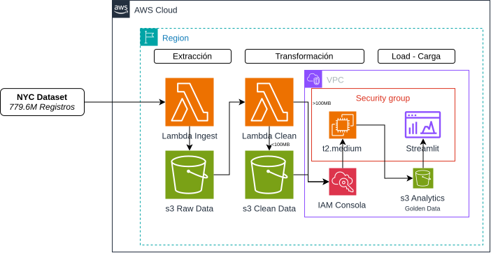

# NYC Urban Mobility Analytics Platform: Cloud Architecture

## Executive Summary
This project implements an end-to-end modern **Cloud Data Lakehouse Architecture** on Amazon Web Services (AWS) to ingest, sanitize, analyze, and visualize over **766 million urban mobility trips** ($23.35B in gross revenue) from the New York City Taxi and Limousine Commission (NYC TLC).

The platform handles multi-year historical datasets (2024, 2025, 2026) across four distinct transportation categories:
- **Yellow Taxis** (Manhattan high-density street-hail)
- **Green Taxis** (Outer-borough street-hail and Boro taxis)
- **FHV** (For-Hire Vehicles, traditional community liveries and black cars)
- **FHVhV** (High-Volume For-Hire Vehicles: Uber, Lyft)

---

## Architecture Diagram

- **Architecture Diagram (Draw.io SVG):** [ArquitecturaProj.drawio.svg](ArquitecturaProj.drawio.svg)



```mermaid
flowchart TD
    subgraph Storage ["Amazon S3 Data Lake (us-west-1)"]
        Raw["Bronze Layer: raw_data/<br>Multi-format raw datasets<br>(.parquet, .csv, .json)"]
        Clean["Silver Layer: clean_data/<br>Standardized, sanitized Parquet<br>(Snappy compressed, 98%+ quality)"]
        Gold["Gold Layer: analytics/<br>Aggregated dimensional metrics<br>(Parquet for instant query)"]
        Lookup["Lookup Catalog: lookup/<br>taxi_zone_lookup.csv (265 NYC Zones)"]
    end

    subgraph ComputeServerless ["Serverless Ingestion & Sanitization"]
        TLC["NYC TLC Public Feeds"] --> LambdaIngest["Lambda 1: Ingestion & Extractor<br>(lambda_ingestion.py)"]
        LambdaIngest -->|Stream to Bronze| Raw
        Trigger["S3 Event Notification<br>(ObjectCreated:*)"] --> LambdaClean["Lambda 2: Data Cleaner<br>(lambda_cleaner.py)"]
        Raw -.->|Micro-batch & Stream| LambdaClean
        LambdaClean -->|Clean & Harmonized| Clean
    end

    subgraph ComputeDistributed ["Distributed Big Data Engine"]
        Spark["Apache Spark 4.1.2 (PySpark)<br>Cluster on Amazon EC2"]
        Clean -->|Read Standardized Data| Spark
        Raw -->|Direct Heavy Ingestion fhvhv (150 GB)| Spark
        Lookup -->|Broadcast Geo Join| Spark
        Spark -->|Export Analytical Aggregations| Gold
    end

    subgraph Presentation ["Presentation & Delivery"]
        App["Streamlit Interactive Dashboard<br>(Python 3.11, Docker, Port 8501)"]
        Gold -->|Zero-latency Query| App
        CI["GitHub Actions CI/CD<br>(Self-hosted Runner on EC2)"] -->|Automated Deploy| App
    end
```

---

## Architectural Layers (Medallion Pattern)

### 1. Bronze Layer (`proyecto-final/raw_data/`)
- **Engine**: **AWS Lambda 1 (Ingestion & Extractor)** (`lambda_ingestion.py`).
- **Source**: Official NYC TLC Portal ([NYC TLC Trip Record Data](https://www.nyc.gov/site/tlc/about/tlc-trip-record-data.page)) with binary datasets distributed via CloudFront CDN (`https://d37ci6vzurychx.cloudfront.net/trip-data/`).
- **Purpose**: Serverless ingestion streaming raw Parquet from NYC TLC feeds directly into immutable storage.
- **Partitioning**: Organized hierarchically by `service_type/year/month/`.
- **Supported Formats**: `.parquet`, `.csv`, `.json`.
- **Characteristics**: Heterogeneous schemas, inconsistent timestamp column names (`tpep_`, `lpep_`, `pickup_datetime`), vendor-specific hardware metadata, and raw compression codecs.

### 2. Silver Layer (`proyecto-final/clean_data/`)
- **Engine**: **AWS Lambda** (Serverless Compute).
- **Configuration**: Python 3.12, 3072 MB RAM, 5-minute timeout, `AWSSDKPandas-Python312` layer.
- **Processing**:
  - Event-driven reactive execution via S3 ObjectCreated triggers.
  - Autonomous multi-file catch-up loop with dynamic garbage collection and PyArrow memory pool release.
  - Normalization of schema headers into a unified canonical schema.
  - Data quality filtering: elimination of corrupted records, negative trip durations, ghost trips (duration <= 0), unrealistic trips (> 24 hours), and accounting anomalies.
  - Storage format: Apache Parquet with Snappy compression.
  - Verified performance: 87 historical files processed with a **98.3%+ data quality score**.

### 3. Workload Routing Strategy (Serverless vs. Distributed)
To prevent serverless anti-patterns:
- Files **< 100 MB** (`fhv`, `green_taxis`, `yellow_taxis`) are routed to **AWS Lambda** for immediate, cost-effective serverless cleaning.
- Files **> 100 MB** (`fhvhv` monthly files ~450 MB each, totaling ~150 GB uncompressed and 650M+ rows) are routed directly to **Apache Spark**. Attempting to process 150 GB in Lambda functions would cause out-of-memory errors and timeout violations.

### 4. Gold Layer (`proyecto-final/analytics/`)
- **Engine**: **Apache Spark 4.1.2 (PySpark)** running natively on Amazon EC2.
- **Processing**:
  - Distributed read across the Silver layer and direct processing of `fhvhv`.
  - Feature selection: discarding hardware and micro-tax noise.
  - Distributed Join with `taxi_zone_lookup.csv` on `LocationID` to enrich trips with official Borough and Zone names.
  - Aggregations:
    1. Overall executive KPIs and fleet volume distribution.
    2. Borough-level mobility demand and total fare revenue.
    3. Rush-hour matrix (Hour of Day x Day of Week) identifying mobility demand peaks.
    4. Top 10 origin-destination travel corridors across NYC.
  - Exported as highly compressed, indexed Parquet tables.

### 5. Presentation Layer (Streamlit Dashboard)
- Hosted on Amazon EC2 inside Docker containers orchestrated by `docker-compose`.
- Continuous Integration & Deployment (CI/CD) automated via GitHub Actions on a self-hosted runner.
- Reads directly from the Gold Layer in S3 using Boto3 and PyArrow, achieving sub-second UI rendering without database bottleneck.
- Provides interactive filtering by Borough, time of day, and urban mobility KPIs.

---

## Architectural Decision: S3 Parquet (Data Lakehouse) vs. Amazon RDS

During the system design phase, using a relational database (Amazon RDS PostgreSQL / MySQL) for the presentation layer was evaluated against storing Golden Data directly in Amazon S3 as Parquet. S3 was selected for the following technical and operational reasons:

1. **Analytical vs. Transactional (OLAP vs. OLTP)**: The dashboard performs analytical queries (aggregations, filters, distributions) rather than row-level transactional updates. Parquet's columnar storage provides superior scan speed and compression compared to row-based relational databases.
2. **Operational Simplicity and Zero Maintenance**: S3 eliminates the need for managing VPC subnets, DB subnet groups, security group inbound rules, connection pooling, database version upgrades, and storage scaling.
3. **Cost Efficiency**: Storing aggregated Parquet files in S3 costs pennies per gigabyte/month with zero idle compute cost, whereas an RDS instance incurs continuous hourly charges even when idle.
4. **Resilience and Decoupling**: The dashboard application accesses data over standard HTTPS using AWS IAM role authentication, eliminating database connection exhaustion under multiple concurrent dashboard sessions.
