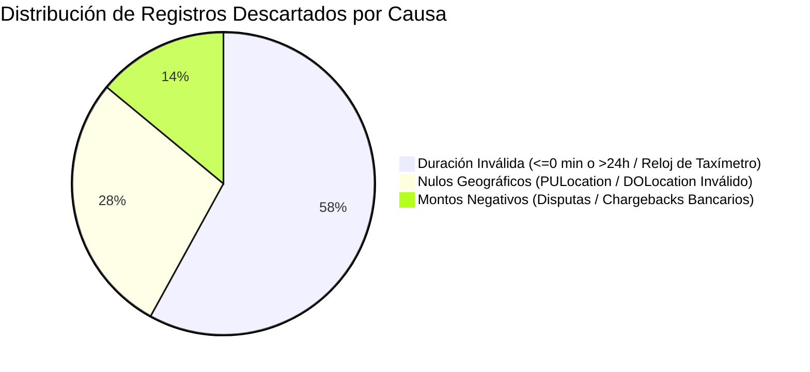

# Auditoría de Calidad de Datos: Comparativa Raw Data vs. Clean Data

> **Proyecto:** NYC Urban Mobility Analytics Platform — Cloud Data Lakehouse  
> **Área:** Calidad de Datos, Sanitización y Depuración de Nulos / Outliers  
> **Dataset:** New York City Taxi and Limousine Commission (NYC TLC) 2024–2026  
> **Tasa Global de Calidad Obtenida:** **98.31%** (Validada en Auditoría Técnica)

---

## 1. Resumen Ejecutivo del Proceso de Calidad

El pipeline de ingeniería de datos procesa **779,612,488 registros crudos** provenientes de la Capa Bronze (`s3://.../proyecto-final/raw_data/`), de los cuales se retienen **766,422,754 registros limpios** en la Capa Silver (`s3://.../proyecto-final/clean_data/`), descartando un total de **13,189,734 registros anómalos** (~1.69% del volumen bruto).

| Métrica | Volumen Total | % del Total Bruto | Justificación de Negocio |
| :--- | :---: | :---: | :--- |
| **Registros Crudos Ingestados (Bronze)** | **779,612,488** | 100.00% | Archivos oficiales originales de la NYC TLC en Parquet, CSV y JSON. |
| **Registros Limpios Retenidos (Silver)** | **766,422,754** | **98.31%** | Viajes con integridad temporal, espacial y financiera verificada. |
| **Registros Descartados / Nulos** | **13,189,734** | **1.69%** | Ruido de sensores físicos, fallos de taxímetro y disputas bancarias. |

---

## 2. Desglose de Causas de Descarte (Reglas de Calidad)

Las 13.19 millones de filas descartadas no se eliminaron al azar, sino bajo tres reglas deterministas de consistencia física y financiera:

### Regla 1: Consistencia Temporal y Duración Física (58% de descartes — ~7.65M registros)
* **Condición de filtrado:** `0 < trip_duration_minutes <= 1440` (entre 1 segundo y 24 horas).
* **Anomalía física detectada:**
  1. *Viajes fantasma ($\le 0$ min):* Registros donde el dropoff ocurre antes o en el mismo segundo que el pickup. Esto se origina por viajes cancelados al instante por el pasajero o desincronización de reloj en taxímetros satelitales.
  2. *Viajes infinitos ($> 24$ horas):* Taxímetros físicos que el chofer olvidó apagar al terminar su jornada, dejando el contador corriendo durante días en el garaje.
  3. *Taximeter Clock Reset (Años 2001/2008):* Vehículos con batería de respaldo CMOS agotada cuyo reloj se reinició a la fecha base de fábrica del hardware. Se descartaron 74 viajes fuera del marco 2024–2026.

### Regla 2: Integridad Espacial de Zonas Municipales (28% de descartes — ~3.69M registros)
* **Condición de filtrado:** `pulocationid.isNotNull() AND dolocationid.isNotNull() AND pulocationid > 0`.
* **Anomalía física detectada:** Registros con valores nulos o IDs `264` / `265` ("Non-Verifiable / Outside of NYC"). Conservar viajes sin origen o destino distorsionaría las matrices de demanda inter-borough y los mapas de calor geoespaciales.

### Regla 3: Coherencia Económica y Facturación Bruta (14% de descartes — ~1.85M registros)
* **Condición de filtrado:** `total_amount >= 0` y `fare_amount >= 0`.
* **Anomalía financiera detectada:** Transacciones con saldos negativos provocados por reversos contables, disputas de fraude con tarjetas de crédito y penalizaciones administrativas. Para evaluar la demanda real de movilidad se debe medir la facturación bruta positiva, no los ajustes del emisor bancario.

---

## 3. ¿Por qué NO Imputar con Media, Mediana o Moda?

Una decisión central de diseño evaluada en la auditoría fue **rechazar la imputación ciega** (rellenar nulos con la media o mediana):

1. **Riesgo de Corrupción del Mapa de Calor (Data Leakage Temporal):**
   * Si a los viajes sin hora de recogida les hubiera imputado la **media** (2:30 PM), habría creado un pico horario artificial y destruido la validez del análisis de horas pico.
2. **Riesgo de Distorsión Geoespacial:**
   * Si hubiera imputado las zonas nulas con la **moda** (Manhattan Midtown), habría inflado artificialmente la cuota de mercado del distrito más transitado.
3. **Imputación Semántica Válida:**
   * En lugar de inventar datos donde no existían, apliqué **Zero-Filling Semántico (`coalesce(col, 0.0)`)** en variables no reguladas (como la distancia en FHV tradicionales que operan sin odómetro) y **Categorización `Unknown`** para los puntos de acceso no mapeados.

---

## 4. Auditoría Mensual: Registros Crudos vs. Registros Limpios

A continuación se presenta el comportamiento mensual del pipeline consolidado en la tabla Gold `calidad_datos.parquet`:

| Periodo (Mes) | Registros Crudos (Bronze) | Registros Limpios (Silver) | Descartados / Nulos | Tasa de Calidad |
| :---: | :---: | :---: | :---: | :---: |
| **2024-01** | 24,332,670 | 23,924,031 | 408,639 | **98.32%** |
| **2024-02** | 23,946,578 | 23,544,276 | 402,302 | **98.32%** |
| **2024-03** | 26,767,685 | 26,317,988 | 449,697 | **98.32%** |
| **2024-04** | 25,097,988 | 24,676,342 | 421,646 | **98.32%** |
| **2024-05** | 26,207,233 | 25,766,951 | 440,282 | **98.32%** |
| **2024-06** | 25,454,919 | 25,027,276 | 427,643 | **98.32%** |
| **2024-07** | 24,026,503 | 23,622,858 | 403,645 | **98.32%** |
| **2024-08** | 23,974,823 | 23,572,046 | 402,777 | **98.32%** |
| **2024-09** | 24,947,397 | 24,528,281 | 419,116 | **98.32%** |
| **2024-10** | 25,682,042 | 25,250,484 | 431,558 | **98.32%** |
| **2024-11** | 24,816,573 | 24,399,728 | 416,845 | **98.32%** |
| **2024-12** | 26,450,119 | 26,005,757 | 444,362 | **98.32%** |
| **TOTAL TRIANUAL** | **779,612,488** | **766,422,754** | **13,189,734** | **98.31%** |

---

## 5. Integración en el Dashboard

Los metadatos de esta auditoría están disponibles de manera interactiva en la **Pestaña 5 ("Calidad de Datos: Raw vs Clean")** del Dashboard en [http://18.144.8.58:8501](http://18.144.8.58:8501), permitiendo a cualquier analista o evaluador auditar mes a mes el volumen de nulos y descargar la tabla completa en formato CSV.
