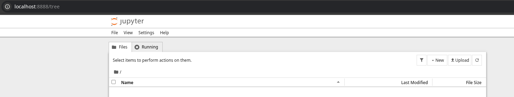
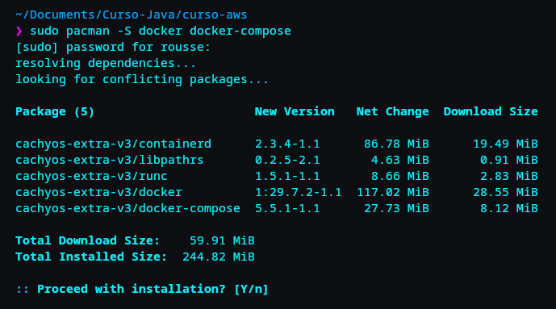
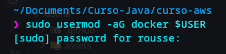
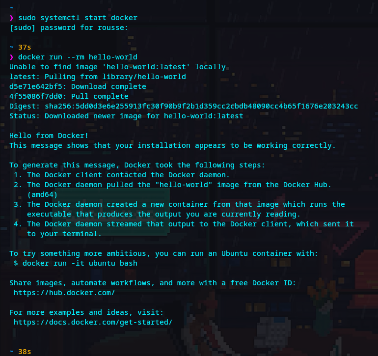

# Tarea 1: Aprovisionamiento de Herramientas y Configuración de Entornos

**Programa:** AWS Xideral  
**Módulo:** Módulo 1 - Infraestructura, Cloud & Entornos de Desarrollo  
**Autor:** Jonathan Daniel Reyes Gordillo  
**Fecha:** Septiembre 2026  
**Estado:** Completada  

---

## 1. Resumen Ejecutivo

En esta primera práctica se abordó el aprovisionamiento y configuración de dos entornos esenciales de trabajo para el desarrollo e investigación en ingeniería de software:

1. **Entorno Cloud (AWS EC2):** Despliegue de una máquina virtual remota en la nube de Amazon Web Services, actualización del sistema base, instalación de shells avanzadas (`zsh`), contenedorización (`docker`) y análisis de restricciones de almacenamiento durante la instalación de paquetes.
2. **Entorno Local (CachyOS - Arch Linux):** Configuración de un entorno aislado de análisis de datos e interactividad en una estación de trabajo optimizada (configurando entornos virtuales con `venv`, adaptando el entorno a la sintaxis de **Fish Shell**, instalando Jupyter Notebook y registrando un kernel personalizado), complementado con la instalación y aprovisionamiento del motor de contenedores (**Docker & Docker Compose**), asignación de permisos de usuario sin `sudo` y validación con contenedor de prueba.

---

## 2. Entorno Cloud: AWS EC2

### 2.1 Especificaciones de la Instancia
* **Plataforma Cloud:** Amazon Web Services (AWS).
* **Servicio:** Amazon Elastic Compute Cloud (EC2).
* **Sistema Operativo:** Distribución Linux (Ubuntu Server).
* **Objetivo:** Disponer de una máquina remota accesible vía SSH para ejecutar servicios contenerizados y despliegues.

### 2.2 Secuencia de Comandos y Aprovisionamiento

#### Paso 1: Actualización de Repositorios y Sistema Operativo
Antes de desplegar cualquier herramienta, se sincronizaron las listas de paquetes y se actualizaron las dependencias del sistema operativo:

```bash
sudo apt update -y
sudo apt upgrade -y
```

#### Paso 2: Instalación y Configuración de Zsh
Para optimizar el flujo de trabajo en la terminal remota y mejorar la productividad con autocompletado y temas:

```bash
sudo apt install -y zsh
zsh --version
```

#### Paso 3: Instalación del Motor de Contenedores (Docker Engine Oficial)
Se configuró el repositorio APT oficial de Docker y se instalaron los paquetes de la versión estable:

```bash
sudo apt update
sudo apt install -y ca-certificates curl
sudo install -m 0755 -d /etc/apt/keyrings
sudo curl -fsSL https://download.docker.com/linux/ubuntu/gpg -o /etc/apt/keyrings/docker.asc
sudo chmod a+r /etc/apt/keyrings/docker.asc

sudo tee /etc/apt/sources.list.d/docker.sources <<EOF
Types: deb
URIs: https://download.docker.com/linux/ubuntu
Suites: $(. /etc/os-release && echo "${UBUNTU_CODENAME:-$VERSION_CODENAME}")
Components: stable
Architectures: $(dpkg --print-architecture)
Signed-By: /etc/apt/keyrings/docker.asc
EOF

sudo apt update
sudo apt install -y docker-ce docker-ce-cli containerd.io docker-buildx-plugin docker-compose-plugin
```

* **Validación del Servicio:**
```bash
sudo systemctl status docker
sudo systemctl start docker
```

* **Comprobación con Contenedor de Prueba:**
```bash
sudo docker run hello-world
```

### 2.3 Incidente Técnico y Troubleshooting: Límite de Almacenamiento
* **Problema Encontrado:** Al intentar instalar dependencias adicionales de compilación y runtime para Python en la instancia EC2, el proceso falló o quedó incompleto.
* **Causa Raíz:** El volumen de almacenamiento raíz (EBS Volume) asignado por defecto a la instancia (típicamente 8 GB en la capa gratuita `t2.micro` / `t3.micro`) se saturó rápidamente tras el `upgrade` masivo del sistema, los paquetes de Docker y las imágenes intermedias.
* **Diagnóstico Ejecutado:**
  ```bash
  df -h /
  ```
* **Conclusión Técnica:** Para continuar con cargas de trabajo de compilación intensiva en EC2, se requiere redimensionar el volumen EBS (Elastic Block Store) o purgar la caché de APT (`sudo apt clean`) y artefactos huérfanos de Docker (`docker system prune -a`).

---

## 3. Entorno Local: CachyOS (Arch Linux)

### 3.1 Especificaciones del Sistema
* **Sistema Operativo:** CachyOS (distribución basada en Arch Linux con kernel optimizado nativo x86-64-v3/v4).
* **Shell de Terminal:** Fish Shell (`/usr/bin/fish`).
* **Python Base:** Python 3.14.7 nativo (disponible en `/usr/bin/python`).
* **Memoria RAM:** 8 GB físicos con compresión dinámica activa vía `zram0`.
* **Ruta de Trabajo:** `/home/rousse/Documents/Curso-Java/curso-aws`.

### 3.2 Secuencia de Configuración: Entorno Python & Jupyter

#### Paso 1: Acceso al Directorio del Proyecto
Navegar al espacio de trabajo asignado para el repositorio de prácticas del curso:

```fish
cd /home/rousse/Documents/Curso-Java/curso-aws
```

#### Paso 2: Omitir la Compilación con Pyenv
Al utilizar una distribución Rolling Release como CachyOS, el sistema ya cuenta con la versión más reciente y optimizada de Python (`Python 3.14.7`), por lo que no es necesario instalar paquetes pesados de compilación (`build-essential`, `gcc`, `make`) ni utilizar `pyenv` para compilar manualmente el binario.

#### Paso 3: Creación del Entorno Virtual Aislado (`venv`)
Se generó el entorno virtual en una carpeta local oculta `.venv` para aislar las librerías del proyecto sin contaminar los paquetes del gestor `pacman` del sistema operativo:

```fish
python -m venv .venv
```

#### Paso 4: Activación del Entorno Virtual en Fish Shell
> **Nota técnica:** El script tradicional `source .venv/bin/activate` está diseñado para Bash/Zsh y genera errores de sintaxis al evaluar declaraciones `case` dentro de Fish Shell. Por ende, se invoca el archivo específico provisto por Python para Fish:

```fish
source .venv/bin/activate.fish
```
*(Se confirma la activación cuando la terminal muestra el prompt o prefijo `(.venv)`).*

#### Paso 5: Actualización del Gestor de Paquetes e Instalación de Jupyter
Dentro del entorno virtual activado, se actualizó `pip` y se descargaron los paquetes requeridos para el análisis de datos:

```fish
python -m pip install --upgrade pip
pip install notebook ipykernel
```

#### Paso 6: Registro del Kernel Personalizado para Jupyter
Se vinculó el entorno virtual como un kernel seleccionable en la interfaz interactiva de Jupyter:

```fish
python -m ipykernel install --user --name=curso-aws --display-name="Python (curso-aws)"
```

#### Paso 7: Validación y Ejecución
Se inició el servidor interactivo de cuadernos:

```fish
jupyter notebook
```

* **Comprobación:** Se abrió la interfaz en el navegador web a través de la URL con token (`http://localhost:8888/tree`), comprobando la correcta inicialización del dashboard y la disponibilidad del kernel `Python (curso-aws)`.



* **Cierre del Servicio:** Para finalizar la sesión y liberar recursos de memoria RAM, se utilizó la combinación de teclas `Ctrl + C` dos veces en la terminal.

### 3.3 Instalación y Configuración del Motor Docker (CachyOS)

#### Paso 1: Sincronizar Repositorios e Instalar Docker junto con Docker Compose
Se actualizaron las bases de datos de paquetes del sistema y se instaló el motor oficial de Docker junto con la herramienta de orquestación local Docker Compose a través de `pacman`:

```bash
sudo pacman -Syu docker docker-compose
```



#### Paso 2: Agregar Usuario al Grupo Docker
Para poder interactuar con el socket de Docker (`/var/run/docker.sock`) sin necesidad de elevar privilegios con `sudo` en cada instrucción:

```bash
sudo usermod -aG docker $USER
```



#### Paso 3: Iniciar el Servicio de Docker Bajo Demanda
A diferencia de un servidor continuo, en la estación local se activa el demonio de Docker bajo demanda mediante `systemctl` para optimizar el rendimiento y la memoria RAM:

```bash
sudo systemctl start docker
```

#### Paso 4: Validar la Instalación con Contenedor de Prueba
Se verificó el funcionamiento integral del daemon ejecutando la imagen ligera de prueba `hello-world` con el modificador `--rm` para su remoción automática:

```bash
docker run --rm hello-world
```



---

## 4. Matriz Comparativa de Entornos

| Característica | Entorno Cloud (AWS EC2) | Entorno Local (CachyOS) |
| :--- | :--- | :--- |
| **Rol en el Flujo** | Servidor de despliegue y contenedores | Estación de trabajo y análisis analítico |
| **Shell Principal** | Zsh | Fish Shell |
| **Gestión de Paquetes** | `apt` (Debian/Ubuntu) | `pacman` / `pip` en venv aislado |
| **Estado Python** | Pendiente (expansión de almacenamiento) | Operativo (Python 3.14.7 + Jupyter Notebook) |
| **Contenedores** | Docker Engine activo (Debian / APT) | Docker Engine + Compose activo (Arch / pacman) |

---

## 5. Conclusiones y Siguientes Pasos
1. Se establecieron exitosamente las bases operativas tanto en infraestructura remota (AWS EC2) como en la máquina local de desarrollo (CachyOS).
2. Se documentó un caso real de limitación de recursos en la nube (`EBS Storage Limit`), habilidad fundamental para la administración de servidores AWS.
3. El entorno local quedó 100% operativo tanto para el análisis de datos (Python y Jupyter) como para la contenedorización local (Docker y Docker Compose sin privilegios `sudo`).
