# Tarea 10: Modelado Relacional y Consultas SQL sobre Catálogo de Películas

**Programa:** AWS Xideral  
**Autor:** Jonathan Daniel Reyes Gordillo  
**Fecha:** Septiembre 2026  
**Tecnología:** SQL / MySQL  
**Entorno de Trabajo:** DBeaver Community  
**Infraestructura Cloud:** Amazon RDS (AWS Relational Database Service)  

---

## 1. Introducción y Objetivos

Esta práctica comprende el diseño, aprovisionamiento y explotación analítica de una base de datos relacional orientada a la gestión de un catálogo cinematográfico. A través de instrucciones estructuradas en lenguaje **SQL**, se aborda:

1. **Definición de Estructura de Datos (DDL):** Selección de la base de datos de trabajo y creación de la tabla `peliculas_jonathan` con restricciones de integridad, clave primaria autoincremental y tipos de datos normalizados.
2. **Poblado de la Tabla (DML):** Inserción por lotes de diez largometrajes con diversidad de directores, géneros, años de estreno, duraciones y calificaciones.
3. **Consultas Analíticas y Operativas:** Resolución de doce requerimientos de extracción, filtrado, ordenamiento, agregación, coincidencia de patrones y actualización de registros, respaldados con evidencia de ejecución.

---

## 2. Entorno y Conexión Cloud: AWS RDS & DBeaver

Para el desarrollo de esta actividad, la base de datos fue desplegada de forma remota en la nube utilizando **Amazon RDS (Relational Database Service)** de **AWS**:

* **Gestor y Cliente de Base de Datos:** Se utilizó el software **DBeaver** para establecer la conexión remota con el endpoint del clúster de Amazon RDS.
* **Validación de Conectividad Cloud:** La conexión remota y la autenticación se establecieron con éxito, verificando la accesibilidad a través de la red y los grupos de seguridad configurados en AWS.
* **Finalidad de la Actividad:** Comprobar y certificar el correcto funcionamiento de la conexión cloud ejecutando de forma interactiva la totalidad de las operaciones de definición (DDL), manipulación (DML) y consultas de negocio sobre la base de datos `cine`.

---

## 3. Creación del Esquema Relacional (DDL)

Se selecciona la base de datos `cine` y se define la tabla `peliculas_jonathan`. Se establecen atributos para identificar de forma unívoca cada producción (`pelicula_id`), registrar metadatos descriptivos (`titulo`, `director`, `genero`), variables cuantitativas (`anio_estreno`, `duracion_minutos`, `calificacion`) y un indicador booleano de disponibilidad (`disponible`) con valor predeterminado en verdadero.

```sql
USE cine;

CREATE TABLE peliculas_jonathan (
    pelicula_id INT AUTO_INCREMENT PRIMARY KEY,
    titulo VARCHAR(150) NOT NULL,
    director VARCHAR(100) NOT NULL,
    genero VARCHAR(50) NOT NULL,
    anio_estreno INT NOT NULL,
    duracion_minutos INT NOT NULL,
    calificacion DECIMAL(3, 1) NOT NULL,
    disponible BOOLEAN NOT NULL DEFAULT TRUE
);
```

---

## 4. Inserción de Datos (DML)

Se realiza la carga inicial de diez títulos representativos del cine contemporáneo y clásico, asegurando la heterogeneidad de directores (Christopher Nolan, Quentin Tarantino, Denis Villeneuve, Bong Joon-ho, etc.) y géneros (Ciencia Ficción, Drama, Animación, Crimen, Acción y Aventura).

```sql
INSERT INTO peliculas_jonathan (titulo, director, genero, anio_estreno, duracion_minutos, calificacion, disponible) VALUES
('Inception', 'Christopher Nolan', 'Ciencia Ficción', 2010, 148, 8.8, TRUE),
('Parasite', 'Bong Joon-ho', 'Drama', 2019, 132, 8.5, TRUE),
('Interstellar', 'Christopher Nolan', 'Ciencia Ficción', 2014, 169, 8.7, TRUE),
('Spider-Man: Into the Spider-Verse', 'Peter Ramsey', 'Animación', 2018, 117, 8.4, FALSE),
('Pulp Fiction', 'Quentin Tarantino', 'Crimen', 1994, 154, 8.9, TRUE),
('Dune: Part Two', 'Denis Villeneuve', 'Ciencia Ficción', 2024, 166, 8.6, TRUE),
('Whiplash', 'Damien Chazelle', 'Drama', 2014, 106, 8.5, FALSE),
('Coco', 'Lee Unkrich', 'Animación', 2017, 105, 8.4, TRUE),
('The Dark Knight', 'Christopher Nolan', 'Acción', 2008, 152, 9.0, TRUE),
('Everything Everywhere All at Once', 'Daniel Kwan', 'Aventura', 2022, 139, 7.8, TRUE);
```

---

## 5. Consultas y Evidencias de Ejecución

### Consulta 1: Extracción Integral del Catálogo
Recuperación de la totalidad de filas y columnas presentes en la tabla para verificar la correcta inserción del conjunto de datos.

```sql
SELECT * FROM peliculas_jonathan;
```

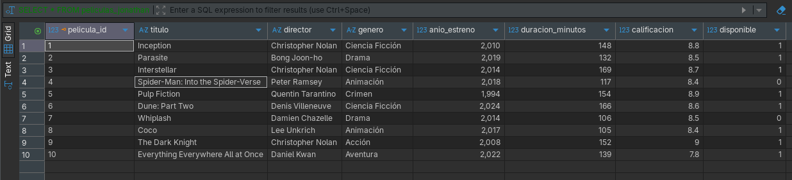

---

### Consulta 2: Proyección de Columnas Específicas
Selección acotada de atributos informativos: título, género y año de estreno de cada producción.

```sql
SELECT titulo, genero, anio_estreno FROM peliculas_jonathan;
```

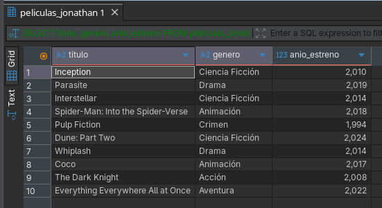

---

### Consulta 3: Filtrado por Disponibilidad
Aplicación de predicado lógico `WHERE` para listar exclusivamente las películas que cuentan con disponibilidad activa para préstamo o reproducción (`disponible = TRUE`).

```sql
SELECT * FROM peliculas_jonathan WHERE disponible = TRUE;
```

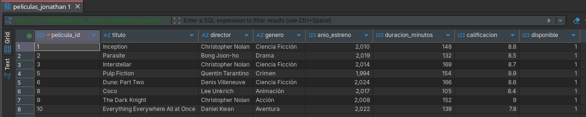

---

### Consulta 4: Filtrado por Categoría de Género
Búsqueda de todas las producciones catalogadas bajo el género específico de `Ciencia Ficción`.

```sql
SELECT * FROM peliculas_jonathan WHERE genero = 'Ciencia Ficción';
```

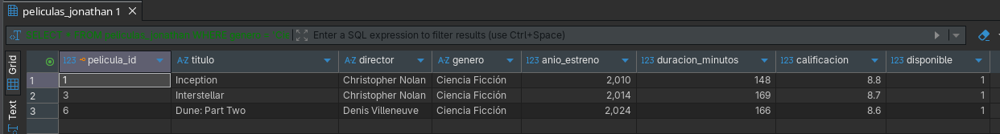

---

### Consulta 5: Filtrado Temporal de Lanzamientos
Extracción de largometrajes modernos estrenados estrictamente después del año 2015.

```sql
SELECT * FROM peliculas_jonathan WHERE anio_estreno > 2015;
```

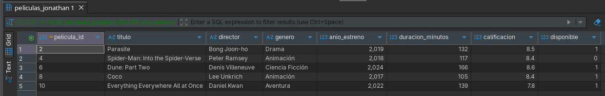

---

### Consulta 6: Filtrado por Umbral de Calificación
Identificación de aquellas películas que han obtenido una valoración crítica superior a 8.0 puntos.

```sql
SELECT * FROM peliculas_jonathan WHERE calificacion > 8.0;
```

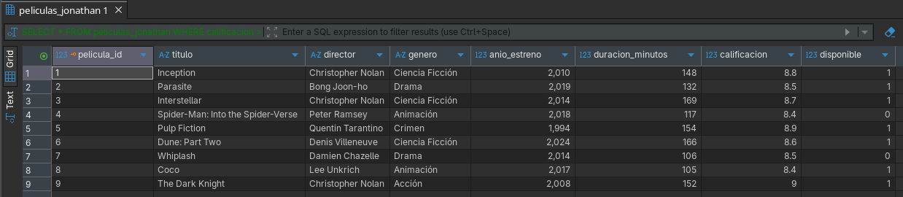

---

### Consulta 7: Ordenamiento Cronológico Descendente
Visualización del inventario cinematográfico organizado desde el estreno más reciente hasta la producción más clásica mediante `ORDER BY ... DESC`.

```sql
SELECT * FROM peliculas_jonathan ORDER BY anio_estreno DESC;
```

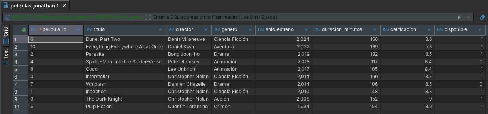

---

### Consulta 8: Búsqueda del Máximo Valor Registrado
Determinación de la película con el puntaje de calificación más alto del catálogo combinando ordenamiento descendente y restricción unitaria (`LIMIT 1`).

```sql
SELECT * FROM peliculas_jonathan ORDER BY calificacion DESC LIMIT 1;
```

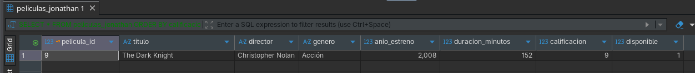

---

### Consulta 9: Métrica de Agregación de Duración
Cálculo del promedio aritmético de la duración en minutos de todas las películas registradas mediante la función de agregación `AVG()`.

```sql
SELECT AVG(duracion_minutos) AS duracion_promedio FROM peliculas_jonathan;
```

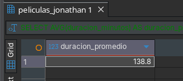

---

### Consulta 10: Agrupación y Conteo por Género
Agrupamiento de registros con `GROUP BY` y cuantificación mediante `COUNT(*)` para obtener la frecuencia y distribución de títulos existentes por cada género cinematográfico.

```sql
SELECT genero, COUNT(*) AS total_peliculas FROM peliculas_jonathan GROUP BY genero;
```

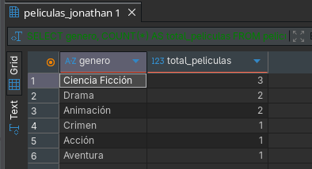

---

### Consulta 11: Coincidencia Parcial de Texto con Operador LIKE
Búsqueda de patrones en cadenas de texto mediante comodines `%` para identificar todas las películas cuyo título contenga el término `'the'`.

```sql
SELECT * FROM peliculas_jonathan WHERE titulo LIKE '%the%';
```

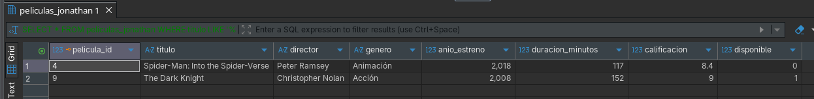

---

### Consulta 12: Actualización de Estado y Verificación
Modificación del estado del registro correspondiente a `Inception` (`pelicula_id = 1`) para cambiar su disponibilidad a `FALSE` mediante `UPDATE`, seguido de una consulta puntual para comprobar la consistencia del cambio efectuado.

```sql
UPDATE peliculas_jonathan SET disponible = FALSE WHERE pelicula_id = 1;

SELECT pelicula_id, titulo, disponible FROM peliculas_jonathan WHERE pelicula_id = 1;
```

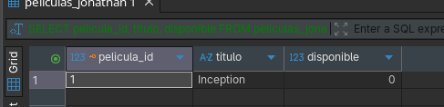

---

## 6. Conclusiones Técnicas

1. **Modelado y Consistencia Relacional:** El uso de tipos adecuados (`DECIMAL(3,1)`, `BOOLEAN`, `VARCHAR`) y restricciones primarias autoincrementales asegura la integridad referencial y de dominio.
2. **Eficiencia en Filtrado y Proyección:** La especificación de columnas reduce el tráfico innecesario de datos y optimiza los planes de ejecución frente al escaneo indiscriminado.
3. **Agregación y Agrupamiento:** Las funciones `AVG` y `COUNT` combinadas con `GROUP BY` proporcionan resúmenes métricos inmediatos sobre el comportamiento de la colección.
4. **Mantenimiento Transaccional:** La sentencia `UPDATE` condicionada por clave primaria garantiza mutaciones atómicas sobre registros específicos sin comprometer el resto del dataset.
5. **Conectividad Cloud Robusta:** La interacción exitosa mediante DBeaver contra Amazon RDS demuestra la viabilidad de administrar y consultar bases de datos relacionales alojadas en arquitecturas cloud escalables.
